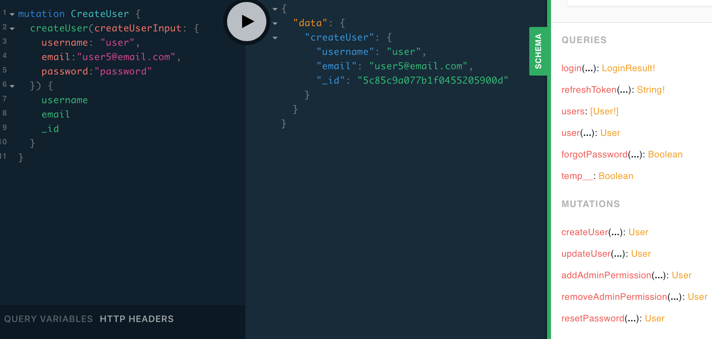

# nest-user-auth

   

If this project helps you, please add a star! If you see an issue, please post it!

This project uses NestJS, GraphQL, and MongoDB.

After facing many challenges starting with NestJS, I decided to open source a starter project to provide a comprehensive, integrated code example to anyone facing the same problems. If you recognize an anti-pattern or a better way to do something, please post an issue.

This project implements user authentication. Adding other GraphQL schemas to this project will be easy following the same structure. User auth has always been one of the hardest and most common thing to implement, so that is what is implemented in this project.



## Getting Started

Ensure a MongoDB server is running locally.

### Create a development.env file

Add a `development.env` file to the root of your project.

```env
MONGO_URI=mongodb://localhost:27017/user-auth
JWT_SECRET=someSecret
EMAIL_ENABLED=true
EMAIL_SERVICE=Mailgun
EMAIL_USERNAME=email@mailgun.com
EMAIL_PASSWORD=emailSMTPpassword
EMAIL_FROM=from@somedomain.com
```

#### Required Parameters

`MONGO_URI` the location of your mongo server and database name you want

`JWT_SECRET` a secret string used to make the keys. Create a random string.

#### Optional Parameters

`JWT_EXPIRES_IN` Seconds until token expires. If not set, there will be no expiration.

`EMAIL_ENABLED` If email services should be used, `EMAIL_*` fields are required if enabled.

`EMAIL_SERVICE` Nodemailer "Well Known Service" https://nodemailer.com/smtp/well-known/

`EMAIL_USERNAME`, `EMAIL_PASSWORD` Information for the SMTP service. On Mailgun it is the credentials under Domains -> SMTP Credentials. Use the SMTP service, not the API.

`EMAIL_FROM` The email address the program will use as the from address.

`TEST_EMAIL_TO` When running tests, where emails will be sent. This should be a real email address you own to verify emails are getting out.

### Start the server

`npm install`

`npm run start`

That's it, the graphQL playground is found at `http://localhost:3000/graphql`

## Model Management

It is challenging not to repeat the structure of the models in the GraphQL schema, Mongo schema, and Typescript interfaces. The goal is to have one truth point for the models and extend that data when more data is needed.

With NestJS 6.0.0 a _code first_ approach was introduced. This project uses the _schema first_ approach to be language agnostic. The starting point for models is the `*.types.graphql` files. They contain the GraphQL schema and have properties that every model, at a minimum, should have.

`@nestjs/graphql` creates a `graphql.classes.ts` file to match the GraphQL schema when the program is started. These classes are used as the base class for the Mongoose Schema and in place of DTOs. Of note, the IMutation and IQuery classes created by `@nestjs/graphql` are not used for the resolver class, though it would be nice if they were. It doesn't appear possible without modification of the `grahql.classes.ts` file because all the methods aren't implemented in the same resolver.

Username is the primary field to identify a user in a request. Initially username or email were accepted, but for simplicity the schema moved to only username. Both username and email fields are in the JWT data, and because they are both unique, either could be used.

The database stores a unique lowercase value for both username and email. This is to lookup the user's username or email without case being a factor. Lowercase username and email are also unique, therefore user@Email.com and user@email.com can't both register. The normal cased version is used for everything except lookup. GraphQL Schemas are not aware lowercase values exist intentionally.

The database handles creating the lowercase values with hooks for `save` and `findOneAndUpdate`. If another method is used to update or save a User, ensure a hook is created to create the lowercase values.

## Users

Add a user via the graphql playground or a frontend. See example mutations and queries below.

Update that user's Document to have the string `admin` in the permissions array. Only an admin can add another admin, so the first user must be done manually. MongoDB Compass is a great tool to modify fields. That user can now add the admin permission or remove the admin permission to or from other users.

The UsersService `update` method will update any fields which are valid and not duplicates, even if other fields are invalid or duplicates.

Users can change their `username`, `password`, `email`, or `enabled` status via a mutation. Changing their username will make their token unusable (it won't authenticate when the user presenting the token's username is checked against the token's username). This may or may not be the desired behavior. If using on a front end, make it obvious that you can change your username and it'll log the user out (front end must get a new token via logging in).

If a user sets `enabled` to `false` on their account, they cannot log back in (because it is disabled), only an admin can change it back.

Because both unique properties username and email can be changed, \_id should be used for many-to-many relationships.

See `test/users.e2e-spec.ts` for expected results to mutations and queries.

## Environments

Add a `test.env` file which contains a different MONGO_URI that `development.env`. See the testing section for details.

Add any other environments for production and test. The environment variable `NODE_ENV` is used to determine the correct environment to work in. The program defaults to `development` if there is not a `NODE_ENV` environment variable set. For example, if the configuration is stored in `someEnv.env` file in production then set the `NODE_ENV` environment variable to `someEnv`. This can be done through package.json scripts, local environment variables, or your launch.json configuration in VS Code. If you do nothing, it will look for `development.env`. Do not commit this file.

## Authentication

Add the token to your headers `{"Authorization": "Bearer eyj2aGc..."}` to be authenticated via the JwtAuthGuard.

If a user's account property `enabled` is set to false, their token will no longer authenticate. Many critiques of JWTs vs. session based authentication solutions are that a JWT cannot be invalidated once issued. While that is true, no request will authenticate with a valid JWT while the account associated with the token's `enabled` field is false. An admin or the user can set that field via an update.

Admin must be set manually as a string in permissions for the first user (add `admin` to the permissions array). That person can then add admin to other users via a mutation. Permissions is an array of strings so that other permissions can be added to allow custom guards.

Users can modify or view their own data. Admins can do anything except refresh another user's token, which would allow the admin to impersonate that user.

The `UsernameEmailGuard` compares the user's email or username with the same field in a query. If any query or mutation in the resolver has `doAnythingWithUser(username: string)` or `doAnythingWithUser(email: string)` and that email / username matches the user which is requesting the action, it will be approved. Username and email are unique, and the user has already been verified via JWT.

The `UsernameEmailAdminGuard` is the same as the `UsernameEmailGuard` except it also allows admins.

The `AdminGuard` only allows admins.

The `JwtAuthGuard` ensures that there is a valid JWT and that the user associated with the JWT exists in the database.

## Testing

To test, ensure that the environment is different than the `development` environment. When the end to end tests run, they will delete all users in the database specified in the environment file on start. Currently running `npm run test:e2e` will set `NODE_ENV` to `test` based on `package.json` scripts. This will default to the `test.env` file.

Create `test.env` to have a different database than the `development.env` file. To test Nodemailer include the variable `TEST_EMAIL_TO` which is the email that will receive the password reset email.

### Example `test.env`

```env
MONGO_URI=mongodb://localhost:27017/user-auth-test
JWT_SECRET=someSecret
EMAIL_SERVICE=Mailgun
EMAIL_USERNAME=email@mailgun.com
EMAIL_PASSWORD=emailSMTPpassword
EMAIL_FROM=from@somedomain.com
TEST_EMAIL_TO=realEmailAddress@somedomain.com
```

## nodemon

To use nodemon there is a small change required. Because the classes file is built from the schema, it is recreated on each launch. This causes nodemon to restart on a loop. Add `src/graphql.classes.ts` to the `ignore` array in `nodemon.json` to ignore the changes to that file.

```typescript
{
  "ignore": ["src/**/*.spec.ts", "src/graphql.classes.ts"],
}
```

## Next tasks

Add email verification when a user registers.

## GraphQL Playground Examples

```graphql
query loginQuery($loginUser: LoginUserInput!) {
  login(user: $loginUser) {
    token
    user {
      username
      email
    }
  }
}
```

```json
{
  "loginUser": {
    "username": "usersname",
    "password": "passwordOfUser"
  }
}
```

```graphql
query {
  users {
    username
    email
  }
}
```

```graphql
query user {
  user(email: "email@test.com") {
    username
  }
}
```

```graphql
query refreshToken {
  refreshToken(username: "username")
}
```

```graphql
mutation updateUser($updateUser: UpdateUserInput!) {
  updateUser(username: "usernametoUpdate", fieldsToUpdate: $updateUser) {
    username
    email
    updatedAt
    createdAt
  }
}
```

```json
{
  "updateUser": {
    "username": "newUserName",
    "password": "newPassword",
    "email": "newEmail@test.com",
    "enabled": false
  }
}
```

```graphql
mutation CreateUser {
  createUser(
    createUserInput: {
      username: "username"
      email: "user@test.com"
      password: "userspassword"
    }
  ) {
    username
  }
}
```

```graphql
mutation {
  addAdminPermission(username: "someUsername") {
    permissions
  }
}
```

```graphql
mutation {
  removeAdminPermission(username: "someUsername") {
    permissions
  }
}
```

```graphql
query {
  forgotPassword(email: "some-email@email.com")
}
```

```graphql
mutation {
  resetPassword(
    username: "username"
    code: "code-from-the-email"
    password: "password"
  ) {
    username
  }
}
```
